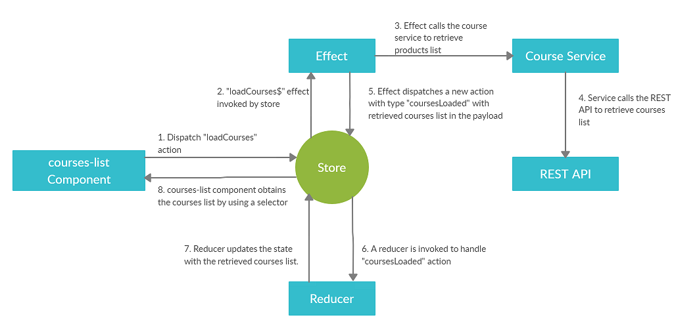
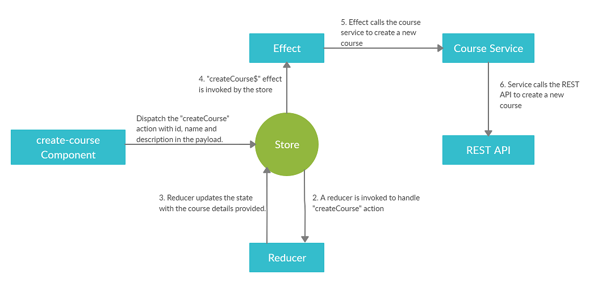
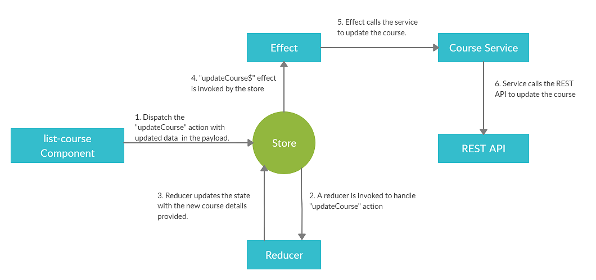

# Projeto baseado no tutorial do site  [betterprogramming.pub](betterprogramming.pub)
All credits reserved for betterprogramming.pub, project for study purposes only

## Você pode acessar o link do projeto aqui: [ Angular: Build a CRUD Application With NgRx](https://betterprogramming.pub/angular-building-a-crud-application-with-ngrx-40e5f1c0b50c)

---
>Para rodar o projeto é necessário um arquivo .jar disponibilizado no link acima
>
>Primeiro Step para rodar o projeto:
>
```
java -jar {path_to_the_jar_file}/course-1.0.0-SNAPSHOT.jar
```
>
>Este arquivo encontra-se na raiz desse projeto, para executalo, você necessita do Java 8
---
> Segundo Step: 
>
```
ng serve
```
>
>Vá para: http://localhost:4200/courses e prossiga com o fluxo de cadastro
>
---

# Arquitetura dos componentes

Retrieve:



Create:



Update: 



Delete: 

